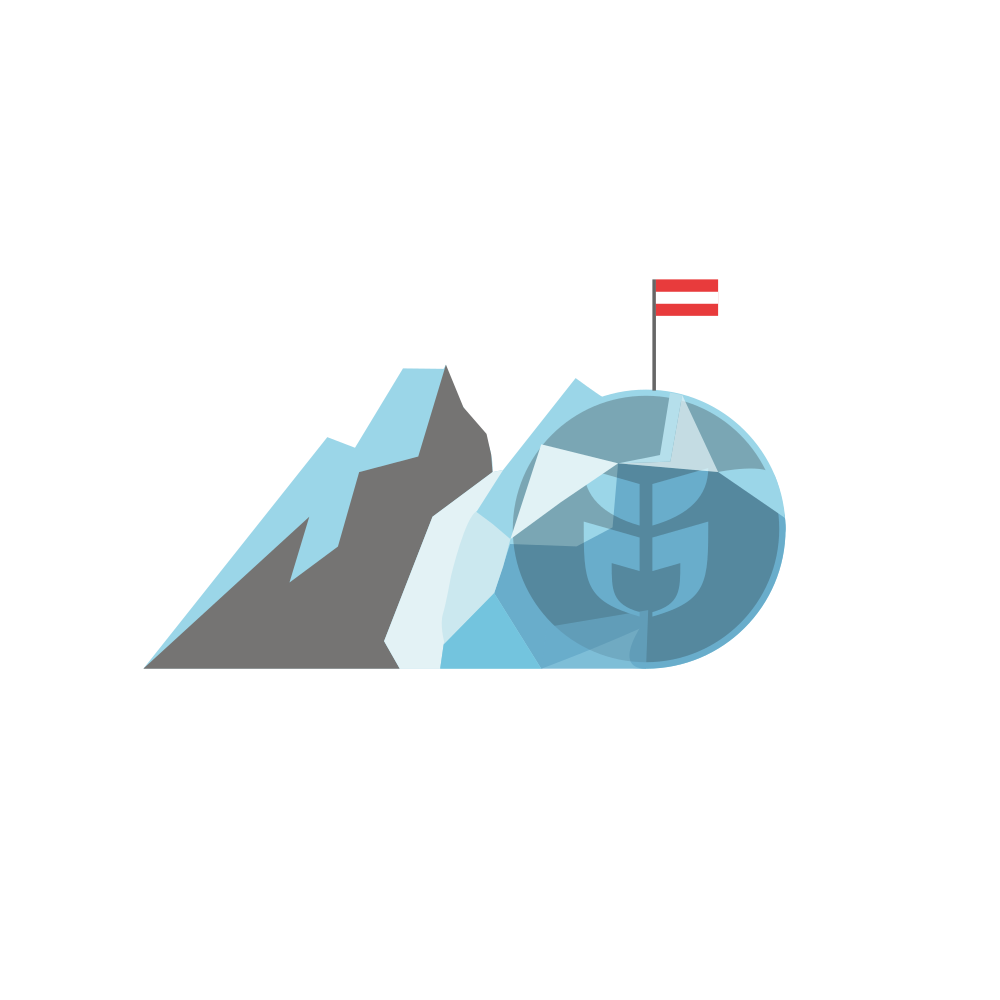

# Glacierctf 2024

## Description

**CTF date:** 22.11.2024 - 23.11.2024

**Duration:** 24 hours

**CTF Time:** https://ctftime.org/event/2402

GlacierCTF 2024 was the third edition of the jeopardy-style CTF organized by LosFuzzys.
The CTF featured challenges in various categories, including blockchain, crypto, misc, pwn, mobile, web and rev. 
The 2024 GlacierCTF repository contains all challenges and solutions/writeups. 

A sincere thank you to all participants and the people who provided the challenges that made this CTF possible. 

**Congratulations to the top 10 overall teams:**
1. P0rtal
2. TU Delft CTF Team
3. KITCTF
4. .;,;.
5. noreply
6. PBR | UCLA
7. Squid Proxy Lovers
8. The Few Chosen
9. Gimel
10. valgrind

**Congratulations to the top 10 academic teams:**
1. TU Delft CTF Team
2. KITCTF
3. .;,;.
4. noreply
5. PBR | UCLA
6. Squid Proxy Lovers
7. WE_0WN_Y0U	
8. zazolcgeslajazn
9. b01lers
10. ENOFLAG
