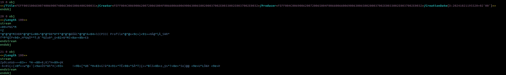

# Writeup

Look into pdf with any text editor, realize there are too many PDF objects.
Find PNG header and a IEND chunk starting from object 20 until last object.

Read out the objects and build the image from them.
Read the flag from the image.
